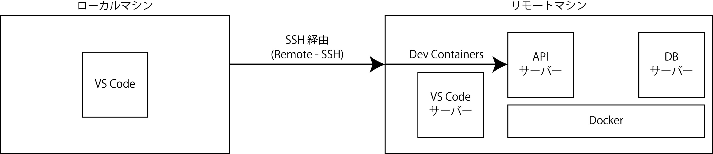
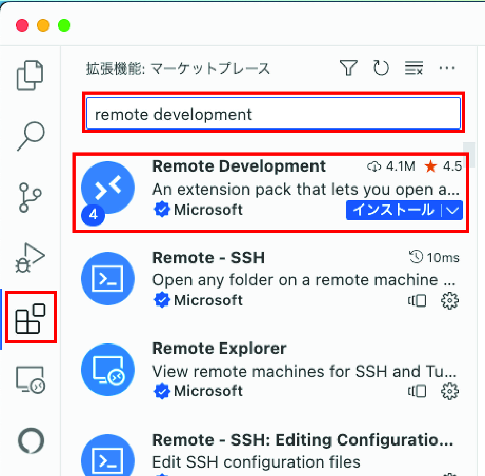
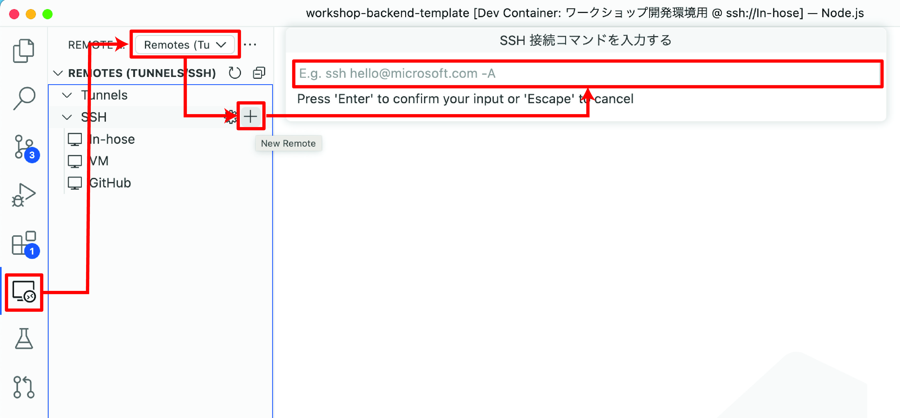
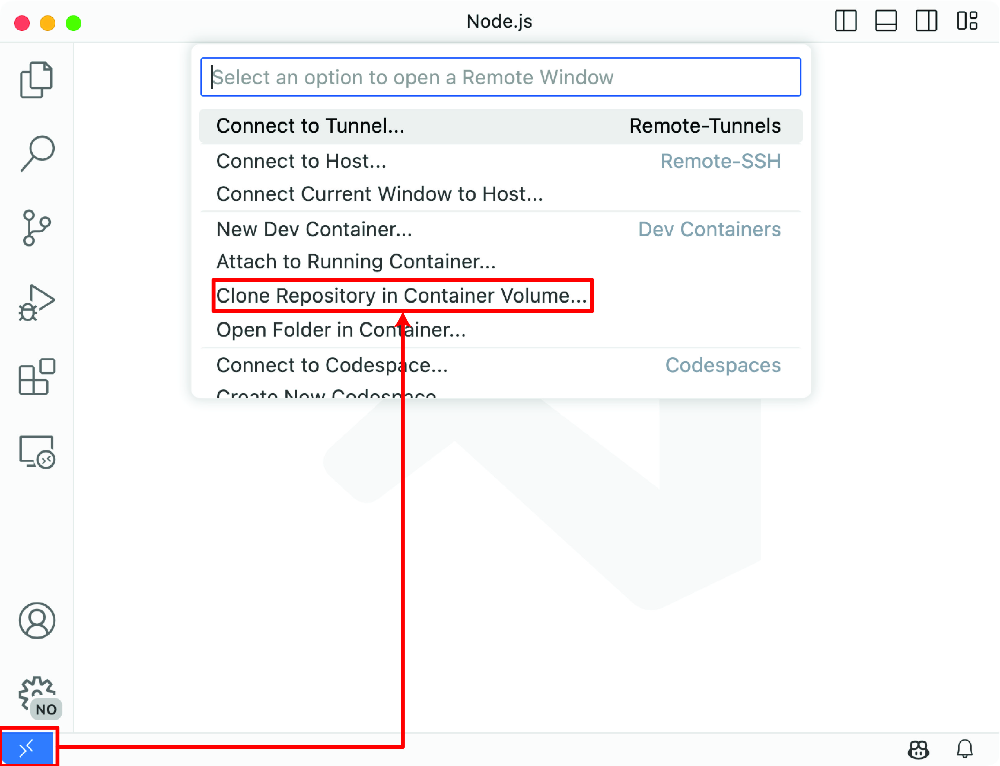
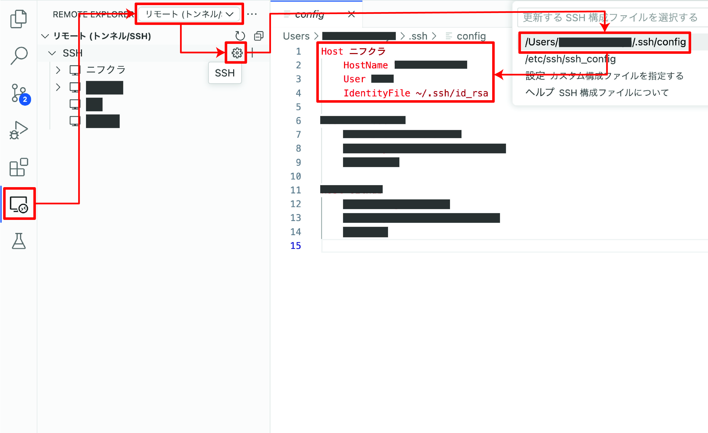

# VS Code Dev Containersで始めるリモート開発環境体験ハンズオン

Visual Studio CodeのDev Containersを使って構築した開発環境を体験するハンズオンです。\
このハンズオンでは、既に用意されている開発環境を使ってAPIサーバーの改修を行います。\
APIサーバーは、PythonのFastAPIを使って構築されています。\
ハンズオンでは、使用するプログラミング言語やライブラリーの知識がなくても問題ありません。資料の指示に従って進めていただければ大丈夫です。

## 目次

- [概要](#概要)
- [はじめに](#はじめに)
  - [1. ツールの動作確認](#1-ツールの動作確認)
  - [2. 拡張機能のインストール](#2-拡張機能のインストール)
  - [3. SSH接続に必要な公開鍵と秘密鍵の準備](#3-ssh接続に必要な公開鍵と秘密鍵の準備)
  - [4. リモートマシンに接続](#4-リモートマシンに接続)
  - [5. Dev Containersの起動](#5-dev-containersの起動)
  - [6. PythonとPostgreSQLの実行環境(🤖)](#6-pythonとpostgresqlの実行環境)
  - [7. Pythonパッケージのインストール(🤖)](#7-pythonパッケージのインストール)
  - [8. DBの初期構築(🤖)](#8-dbの初期構築)
  - [9. Gitのユーザ名とメールアドレスを設定](#9-gitのユーザ名とメールアドレスを設定)
  - [10. アプリケーションの起動](#10-アプリケーションの起動)
  - [11. クリーンアップ](#11-クリーンアップ)
- [付録](#付録)

## 概要

このハンズオンでは、VS Code Dev Containersを使ってリモート開発環境に接続します。\
リモート開発上では、APIサーバーとDBサーバーがDockerコンテナ上で動作しています。

| コンテナ | 用途 |
| --- | --- |
| APIサーバー | バックエンドアプリケーションの実行環境<br>FastAPI(Python)を使用。 |
| DBサーバー | データベースの実行環境<br>PostgreSQLを使用。 |

リモートマシンは、ニフクラのクラウドサービスを使用します。
リモートマシンに使用できる環境は、各種クラウドサービスや社内のオンプレミスサーバーなどがあります。
他にもローカルマシーンのDockerコンテナ上に構築でき、リモートマシンに接続するよりも少しだけ簡単です。

リモートマシン上の開発環境にアクセスするにはSSH接続をします。\
今回は、Visual Studio Codeのリモートエクスプローラーを使いリモートマシンに接続します。\
その際に使用する拡張機能は「Remote - SSH」です。



## はじめに

「🤖」は、Dev Containersの仕組みを使って自動で実行されるタスクです。

### 1. ツールの動作確認

**1-1. Visual Studio Codeが起動できる**

通常のアプリケーションを起動する手順と同じように、Visual Studio Codeを起動します。

**1-2. Gitコマンドが使用できる**

コマンドを実行して、Gitのバージョンが表示されることを確認します。\
もしバージョンが正しく表示されない場合は、Gitのインストールが正しくできていない可能性があります。\
問題解決にサポートが必要な場合は、進行担当者にお知らせください。

```shell
git version
```

### 2. 拡張機能のインストール

リモート開発をするために必要な拡張機能をVisual Studio Codeにインストールします。

1. Visual Studio Codeを開く
2. アクティビティバーから拡張機能を表示する
3. 検索欄で[Remote Development](https://marketplace.visualstudio.com/items?itemName=ms-vscode-remote.vscode-remote-extensionpack)と入力してエンターを押す
4. 検索結果が表示されたら、`Remote Development`をクリックしてインストールする
5. アクティビティバーに`リモートエクスプローラー`が追加されたことを確認する



**もし表示されていない場合**

アクティビティバーに表示されない場合は、　アクティビティバー上で右クリックして`リモートエクスプローラー`が一覧上で非表示(チェックマークがついていない状態)設定になっている場合は、クリックして表示状態に設定を変更します。\
もし、この一覧上でも表示されていない場合は、コマンドをパレット（ショートカットは<kbd>Command</kbd> + <kbd>Shift</kbd> + <kbd>P</kbd>）を表示してから`Developer: Reload Window`を実行してVisual Studio Code自体を再読み込みします。\
それでも解決しない場合は、進行担当者にお知らせ下さい。

### 3. SSH接続に必要な公開鍵と秘密鍵の準備

このハンズオンでは、SSH公開鍵認証方式を使用して、リモートマシンに接続して作業します。\
SSH公開鍵認証方式にはSSH公開鍵と秘密鍵のペアが必要です。
このハンズオンでは、受け渡し作業の簡素化のためにGitHubに登録している公開鍵を接続先のサーバーに登録します。

**GitHubに登録したSSH鍵のペアが分からない人向け**

通常GitHubのプライベートリポジトリからソースコードを取得する際は、SSHまたはHTTPSのいずれかを使って接続します。\
GitHubページにアクセスして設定画面の[SSH and GPG keys](https://github.com/settings/keys)からSSH鍵が登録されているかを確認できます。\
登録されている公開鍵のペアとなる秘密鍵がどれかわからない場合は、新しくSSH鍵を作成します。

SSH鍵を作成してGitHubに登録する方法は、GitHub公式ドキュメントの[新しい SSH キーを生成して ssh-agent に追加する](https://docs.github.com/ja/authentication/connecting-to-github-with-ssh/generating-a-new-ssh-key-and-adding-it-to-the-ssh-agent?platform=mac)を参照ください。

### 4. リモートマシンに接続

1. アクティビティバーからリモートエクスプローラーを開く
2. 上部にあるリストダウンから`リモート(トンネル/SSH)`を選択する
3. SSHセクションの右端にある「+」ボタンを押して、SSHコマンドを貼り付けてエンターを押す
4. Configファイルの登録先を聞かれたら、`~/.ssh/config`を選択する
5. SSHセクションにある歯車アイコンをクリックして、先ほど入力した内容が反映されていることを確認する
6. `リモート(トンネル/SSH)`をクリックして、Configに登録されている内容が表示されることを確認する
7. 接続したい環境上にマウスカーソルを合わせて、`新しいウィンドウで接続...`をクリックする
8. 新しいウィンドウでVS Codeが起動することを確認する



**VS Codeに貼り付けるSSHコマンドの作成方法**

`<リモート環境のIPアドレス>`は、進行担当者からお知らせします。\
`<GitHubに登録しているSSH鍵の秘密鍵ファイルのパス>`は、`~/.ssh/`フォルダ内に格納されているSSHキーのうちGitHubに登録している秘密鍵を選択します。

```shell
ssh root@<リモート環境のIPアドレス> -i <GitHubに登録しているSSH鍵の秘密鍵ファイルのパス>
```

**Configファイルに登録された内容を変更したい場合**

SSHセクションの歯車アイコンをクリックし、通常のエディタ操作のようにファイルを編集して変更ができます。

### 5. Dev Containersの起動

前の手順でリモートマシンに接続ができました。\
ここからDev Containersを使用して開発環境を起動します。\
通常はDockerなどのCLIツールのインストールが必要ですが、ハンズオン環境構築時にプリインストール済みです。

今回はバックエンド開発としてAPIサーバーの機能変更を行いながら、リモート開発環境上での開発を体験していただきます。\
詳しくは、プログラミング言語にPythonを使用し、フレームワークにFastAPIを使用しています。また、DBサーバーはPostgreSQLです。

これらを使った開発を行うためには、事前にさまざまなツールのインストールなどが必要ですが、今回はリモート開発のメリットの一つである環境構築の部分の自動化を体験していただきます。\
詳しい設定などについては、Dockerfile、docker-compose.yml、devcontainer.jsonなどに既述されています。

では、Dev Containersを起動してみましょう。

1. アクティビティバーのリモートエクスプローラーを開開く
2. 上部にあるリストダウンから`開発コンテナー`を選択
3. 開発コンテナセクションにある「+」ボタンを押し、`コンテナボリュームにリポジトリを複製...`を選択
4. `GitHub`を選択
5. `VirtualTech-DevOps/workshop-backend-20230826`を選択してエンターを押す
6. ブランチ名は`main`を選択してエンターを押す
7. ボリュームの選択は`新しいボリュームを作成します...`を選択してエンターを押す
8. ターゲットのフォルダ名は表示されたデフォルト値のままエンターを押す



### 6. PythonとPostgreSQLの実行環境(🤖)

このハンズオンでは、PythonとPostgreSQLの実行環境が必要ですが、Dockerの仕組みを使ってあらかじめDockerfileとdocker-compose.ymlを用意しています。\
Dev Containersでは、このDockerfileとdocker-compose.ymlを使って環境を構築します。

### 7. Pythonパッケージのインストール(🤖)

[poetry](https://github.com/python-poetry/poetry)を使ってパッケージをインストールします。\
通常は`poetry install`コマンドを実行して依存パッケージをインストールしますが、Dev Containersの仕組みを使って自動でインストールされるようにしています。

### 8. DBの初期構築(🤖)

マイグレーションツールの1つである[alembic](https://github.com/sqlalchemy/alembic)を使ってデータベースの初期構築を行います。\
通常は`alembic upgrade head`コマンドを実行してデータベースを作成しますが、Dev Containersの仕組みを使って自動で作成されるようにしています。

### 9. Gitのユーザ名とメールアドレスを設定

GitHubを使用する際は、Gitの設定でユーザ名とメールアドレスを設定する必要があります。\
普段使用しているものがあればそれを設定してください。初めての方は次のように設定してください。

| 項目 | 設定内容 |
| --- | --- |
| `<ユーザ名>` | GitHub IDを入力 |
| `<メールアドレス>` | GitHubに登録しているメールアドレスを入力 |

※もし入力する内容に抵抗がある場合は、進行担当者にお知らせください。

```shell
git config --local user.name "<ユーザ名>"
git config --local user.email "<メールアドレス>"
```

**タスク機能を使用して設定する場合**

Command + Pを押して、`Tasks: Run Task`を選択してください。\
`Git: Set git config user.name and user.email`を選択してください。\
画面の指示に従ってユーザ名とメールアドレスを入力してください。
</details>

### 10. アプリケーションの起動

このハンズオンでは、よく使うコマンドをMakefileに集約しています。\
アプリケーションを起動する際は、makeコマンドを使用してください。

```shell
make start
```

次のように`Application startup complete.`と表示されたら、`https://localhost:8000/docs`にアクセスしてAPIのドキュメントが表示されることを確認してください。

```shell
INFO:     Will watch for changes in these directories: ['/workspaces/workshop-backend-template']
INFO:     Uvicorn running on http://127.0.0.1:8000 (Press CTRL+C to quit)
INFO:     Started reloader process [12433] using WatchFiles
INFO:     Started server process [12440]
INFO:     Waiting for application startup.
INFO:     Application startup complete.
```

### 11. クリーンアップ

ハンズオンお疲れ様でした。\
最後にハンズオンで使用したローカルマシン上のリソースを削除します。\
接続先のリモートマシン環境は、ハンズオン終了後に環境が削除されますが、ローカルマシン上で保持されているRemote - SSHの接続先情報を削除してください。

**Remote - SSHの接続先を削除する方法**

1. アクティビティバーのリモートエクスプローラーを開く
2. 上部にあるリストダウンから`リモート(トンネル/SSH)`を選択
3. SSHセクションの右端にある歯車マークを押し、`/Users/<ユーザー名>/.ssh/config`を選択
4. config内にある`Host xxx.xxx.xxx.xxx`の行を削除する

既に登録していた他の接続先情報を削除しないように注意してください。



</details>

## 付録

本日のハンズオンでは、プログラミングの細かい部分をスキップさせて頂きました。\
もし、細かい内容に興味がある方は、以下の内容を参考にしてください。

参加者は、【1】のみを実施してください。\
後ほど講師役の方が【2】を実施してから参加者の方にプルリクエストを投げます。

-  [【1】送料追加(参加者用)](WORKSHOP_SHIPPING_FEE.md)
-  [【2】手数料追加(講師用)](WORKSHOP_COMMISSION.md)
