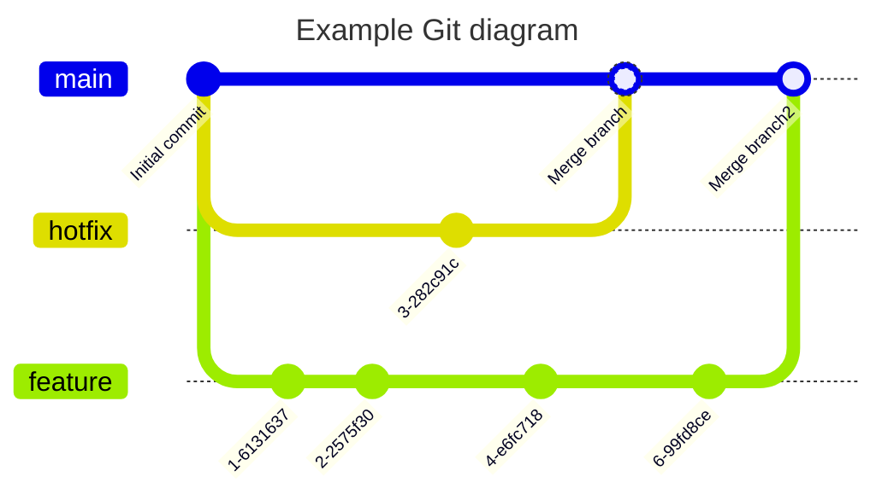

# 送料を追加(参加者用)

これから商品情報(Item)に送料を追加します。

1. 開発用のブランチを作成
   1. 左下にある`main`と表示されたブランチ名をクリックする
   2. `Create new branch`を選択する
   3. 表示されたブランチに`feature/****`と表示されていることを確認して、`Enter`を押す
   4. 左下のブランチ名が`feature/****`に変わっていることを確認する
2. 変更前の動作確認
   1. [https://localhost:8000/docs](https://localhost:8000/docs)にアクセスする
   2. POST /itemsを開く
   3. `Try it out`を押す
   4. Bodyの内容は変更せずに`Execute`を押す
   5. `Server responses`に`200`と表示されていることを確認する。
   6. `Response body`にリクエスト時の内容が表示されていることを確認する
   7. GET /itemsを開く
   8. `Try it out`を押す
   9. `Execute`を押す
   10. `Server responses`に`200`と表示されていることを確認する。
   11. `Response body`に作成時の内容が表示されていることを確認する
3. モデルの変更
   1. [api/models/item.py](api/models/item.py)を開く
   2. [モデルの変更](#モデルの変更)のセクションを参考にコードを追加する
4. スキーマの変更
   1. [api/schemas/item.py](api/schemas/item.py)を開く
   2. [スキーマの変更](#スキーマの変更)のセクションを参考にコードを追加する
5. CRUDSの変更
   1. [api/cruds/item.py](api/cruds/item.py)を開く
   2. [CRUDSの変更](#crudsの変更)のセクションを参考にコードを追加する
6. マイグレーションファイルの作成
   1. 「マイグレーションファイルの作成」のセクションを参考にコマンドを実行する
   2. `alembic/versions/`に`****_add_shipping.py`が作成されていることを確認して、ファイルを開く
   3. [マイグレーションファイルの作成](#マイグレーションファイルの作成)のセクションを参考にコードを追加する
7. DBのマイグレーションを実行
   1. [DBマイグレーションの実行](#dbマイグレーションの実行)のセクションを参考にコマンドを実行する
8. 変更後のドキュメントを確認
   1. POST /itemsを開く
   2. 送料の項目が追加されていることを確認する
   3. GET /itemsを開く
   4. 送料の項目が追加されていることを確認する
9.  差し込みのレビュー対応
    1.  [レビュー用の開発環境の立ち上げ](#レビュー用の開発環境の立ち上げ)のセクションを参考に開発環境を立ち上げ
    2.  開発中の環境に影響を与えることなく、並行して環境を立ち上げられていることを確認する
    3.  (実際にレビューは不要です)
    4.  動作確認ができたら、ウィンドウを閉じてレビュー用の開発環境を終了する
10. プルリクエストの作成
    1.  開発用の環境に戻る
    2.  [プルリクエストの作成](#プルリクエストの作成)のセクションを参考に作成する

## ブランチの作成と基本的な知識

このハンズオンでは、Visual Studio Codeのカスタム機能を使ってブランチ名をランダムで提案する機能を使用します。\
スムーズな進行の都合上、ブランチ名はそのまま使用することとします。\

Git-flowやGitHub-flowなど様々なブランチ戦略がありますが、今回はGitHub-flowを採用します。\
GitHub-flowでは、`main`ブランチをメインブランチとして使用し、`feature`ブランチを作業ブランチとして使用します。\
`main`ブランチは、リリース可能な状態を保つため、直接コミットすることはありません。\
`feature`ブランチは、`main`ブランチから分岐して作業を行い、作業が完了したら`main`ブランチにマージします。\

作業前にブランチを作成します。\
今回はVS Codeの機能でランダムでブランチ名が作成されますので、提案されたブランチ名をそのまま使用することとします。\
`feature`ブランチは、これから皆さんが作業するブランチです。\
`hotfix`ブランチは、講師役の方が作業するブランチです。作業中に急ぎマージしたいプルリクエストの想定でレビューを行ってもらいます。

↓画像では、説明上わかりやすいように複数のラインであえて`hotfix`という表現を使用していますが、GitHub-flowでは使用しないブランチ名です。



送料を追加するために幾つかのファイルを編集していきます。

## モデルの変更

このワークショップではORMを使ってデータベースを操作します。\
モデルは、データベースのテーブルと対応しています。

まずはじめにモデルに送料を表すフィールドを追加します。
追加方法は、[item.py](api/models/item.py)に以下のコードを追記してください。

```diff
class Item(Base):
    __tablename__ = "items"

    id = Column(Integer, primary_key=True)
    name = Column(String(1024))
    price = Column(Integer)
+   shipping_fee = Column(Integer, default=0)
```

## スキーマの変更

スキーマにも同じように送料を追加します。\
スキーマは、APIのリクエストやレスポンスの形式を定義しています。

[item.py](api/schemas/item.py)に以下のコードを追記してください。

```diff
class ItemBase(BaseModel):
    name: str = Field(..., example="一眼レフカメラ", description="商品名")
    price: int = Field(..., example=1000, description="価格")
+   shipping_fee: int = Field(0, example=500, description="送料")
```

## CRUDSの変更

CRUDSは、データベースの操作を行う関数を定義しています。\
CRUDSの関数は、モデルを引数に取り、モデルを返します。

[item.py](api/cruds/item.py)に以下のコードを追記してください。

```diff
def update_item(
    db: Session,
    item: item_schema.ItemCreate,
    original: item_model.Item,
) -> item_model.Item:
    original.name = item.name
    original.price = item.price
+   original.shipping_fee = item.shipping_fee
    db.commit()
    db.refresh(original)
    return original
```

## マイグレーションファイルの作成

Modelに変更を加えたので、データベースのテーブルの定義も変更する必要があります。\
データベースのテーブルの定義を変更するには、マイグレーションファイルを作成する必要があります。

マイグレーションファイルを作成するには、以下のコマンドを実行してください。

```shell
make new-migrate MESSAGE="add shipping_fee"
```

コマンドの実行に成功すると、`alembic/versions`ディレクトリにマイグレーションファイルが作成されます。\
何らかのデータをテーブルに登録している場合も想定して既存データのリペア処理を追加する必要がありますが、すべて0円になるよなクエリを既述します。

`xxxxx_add_shipping_fee.py`ファイルを開き、以下のコードを追記してください。\
`xxxxx`の部分はハッシュ値ですので、実際には異なる値になります。

```diff
def upgrade() -> None:
    # ### commands auto generated by Alembic - please adjust! ###
    op.add_column("items", sa.Column("shipping_fee", sa.Integer(), nullable=True))
    # ### end Alembic commands ###
+   op.execute("UPDATE items SET shipping_fee = 0")
```

## DBマイグレーションの実行

マイグレーションファイルを作成したので、実際にデータベースに反映させます。\
以下のコマンドを実行してください。

```shell
make migrate
```

これで実際のデータベースにテーブルの変更が反映されました。

## レビュー用の開発環境の立ち上げ

ここで開発の途中ですが差し込みレビューが入ったので、ブランチの切り替えや先ほど反映したDBのマイグレーションを変更する必要があります。\
使い慣れた方であれば他の手段などを用いて対応することもできると思いますが、今回はDev Containersの仕組みを用いて丸っと開発環境から新しく作ってレビューを対応する方法を体験してもらいます。

手順は初めて開発環境を立ち上げた時と似ています。

1. アクティビティバーのリモートエクスプローラーを開く
2. 左上の「+」をクリックして「Clone GitHub Pull Request in Container Volume ...」を選択
3. 事前に伝えられたプルリクエストのURLを入力してEnterを押す
4. プルリクエストのブランチがチェックアウトされた状態で開発環境が立ち上がります

**プルリクエストのブランチに切り替わらない場合**

プルリクエストのブランチに切り替わらない場合は、ブランチを手動で切り替えてください。\
ブランチを作成する手順と似ています。

1. 左下のブランチ名をクリック
2. プルリクエストのブランチを選択

## プルリクエストの作成

Visual Studio Codeの機能を使ってプルリクエストを作成する方法を体験してもらいます。\
プルリクエストやイシューを操作するためには、[GitHub Pull Requests and Issues](https://marketplace.visualstudio.com/items?itemName=GitHub.vscode-pull-request-github)の拡張機能を使用しています。\
Dev Containersの機能を使用して開発環境立ち上げ時にプリインストールしています。

1. 左のアクティビティバーのソース管理をクリック
2. コミットしたい変更を「＋」をクリックしてステージングする
3. コミットメッセージを入力して、コミットしてプッシュする
4. プッシュしたら、右下の通知からプルリクエストを作成するか聞かれるので作成する
5. (実際にプルリクエストをマージしません)

**プルリクエスト作成時のコンフリクトについて**

ワークショップの都合上、同じファイルを参加者全員で編集しているため、GitHubにプッシュした時点でコンフリクトが発生します。\
実際にマージするところまでは行いませんので、コンフリクトが発生しても無視してください。